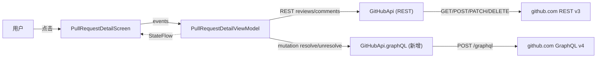

# PR Review Flow — 技术设计

Feature Name: pr-review-flow
Updated: 2026-07-22

## Description

为 PR 详情页补齐完整 review 流程: 顶部入口提交 approve/request-changes/comment、reviews 列表、行内评论回复、行内评论编辑/删除、resolve/unresolve、merge 时的 review 决策联动告警。REST 仍是最主要通信通道, 仅有 resolve/unresolve 走一条额外 GraphQL 端点。

## Architecture



数据通道沿用现有 Single-Activity + Hilt + Retrofit 架构:
- `PullRequestDetailViewModel` 继续是 PR 详情唯一的 source-of-truth
- 在 VM 内新增 reviews list、inline review dialog state、resolve state 等几路 StateFlow
- GraphQL 走 Retrofit 同一 `GitHubApi` 上挂的一个新 `@POST("graphql")` 接口, body 是 JSON 形式的 GraphQL query, 鉴权复用 `AuthInterceptor`

## Components and Interfaces

### 1. API 层 (`GitHubApi.kt`)

新增 endpoint 与 DTO：

```kotlin
@POST("graphql")
suspend fun graphQL(@Body body: GraphQLRequest): GraphQLResponse

@Serializable data class GraphQLRequest(val query: String, val variables: Map<String, JsonElement> = emptyMap())
@Serializable data class GraphQLResponse(val data: JsonObject? = null, val errors: JsonArray? = null)
```

Resolve / Unresolve mutation 用内联字符串拼接(最小代码量):

```
mutation ResolveThread($id: ID!) { resolveReviewThread(input: {threadId: $id}) { thread { isResolved } } }
mutation UnresolveThread($id: ID!) { unresolveReviewThread(input: {threadId: $id}) { thread { isResolved } } }
```

thread ID 来源: 由 `listPullRequestReviewComments` 返回的 `pull_request_review_thread_id` 直读 — REST comment 对象上没有该字段, 需要追加 GraphQL `pullRequestReviewThreads(first:100)` query 拉一次映射表 threadId → comments. 这部分实现细节见 Correctness Properties 中的 (T2) 不变量。

### 2. ViewModel 层 (`PullRequestDetailViewModel.kt`)

新增 StateFlow:

- `reviews: StateFlow<List<PullRequestReview>>` — 全量 reviews 列表
- `threadState: StateFlow<Map<Long, ThreadInfo>>` — key = 根 reviewComment id, value = {isResolved, threadId}
- `reviewSubmitState: StateFlow<ReviewSubmitState>` — Idle / Submitting / Submitted / Error(msg)

新增方法:

- `submitReview(event: ReviewEvent, body: String)` — 调 `createPullRequestReview` + 触发 PR refresh
- `replyInlineComment(rootId: Long, body: String)` — 调 `createPullRequestReviewComment(inReplyTo=rootId)` + 乐观更新
- `editInlineComment(commentId: Long, newBody: String)` — 调 `PATCH /repos/.../pulls/comments/{id}`
- `deleteInlineComment(commentId: Long)` — 调 `DELETE /repos/.../pulls/comments/{id}`, 如是 thread 根, 整 thread 移除
- `resolveThread(threadId: String, rootCommentId: Long)` — 调 graphQL resolve
- `unresolveThread(threadId: String, rootCommentId: Long)` — 调 graphQL unresolve

GitHubApi 已有的 `PATCH/DELETE /pulls/comments/{id}` 现状缺失, 需补两个声明.

### 3. UI 层 (`PullRequestDetailScreen.kt`)

#### 3.1 顶栏新增 "Review" 按钮
`RepoDetailScreen` 的 PR 详情顶栏(已存在 `Watch`/`Share`/`Download`)右上新增 `Icons.Outlined.RateReview`, 点击展开 `ReviewSubmitSheet`(ModalBottomSheet):

- ReviewEvent 单选 (Comment / Approve / Request Changes)
- body 多行输入(`OutlinedTextField`)
- Cancel / Submit 按钮
- 当 SubState=Submitting 显示 LinearProgressIndicator
- 当 SubState=Error 顶部红条

#### 3.2 Reviews Section
在 `Files tab` 之前新增 "Reviews" 区段. 单位:

- reviewer 头像 + 用户名 + state 标签:
  - APPROVED = 绿色
  - CHANGES_REQUESTED = 橙色
  - COMMENTED = 灰色
  - DISMISSED = 删除线灰色
  - PENDING = 黄色
- 提交时间(`languageColorHex` 类复用的 formatRelative utils)
- body 折叠(2 行预览 + 点击展开)

#### 3.3 行内评论 thread 渲染调整
现在每个 file 级 `reviewComments` 已经按 path 分组渲染. 在每个 thread 的最后一行下方新增一行:

- 右侧 IconButton "Reply" -> 展开输入框
- 右侧 IconButton "Resolve"/"Unresolve" 取决于 thread state
- 根评论 + 当前评论作者为自己: 隐藏多余的 Edit / Delete, 文章旁加 `...` 弹菜单

#### 3.4 Merge 联动
合并区域(本已存在)上方加一条 Card, 仅当 reviews 中存在未 dismiss 的 CHANGES_REQUESTED 时出现:

- 文字: "{count} reviewers requested changes"
- 仍可点击 Merge, 但弹二次确认 (`AlertDialog`)

## Data Models

### PullRequestReview (已存在于 GitHubApi, 复用)
- `id: Long`
- `user: User?`
- `body: String?`
- `state: String?` (APPROVED / CHANGES_REQUESTED / COMMENTED / DISMISSED / PENDING)
- `submittedAt: String?`
- `commitId: String?`

新增 ReviewEvent 配合 R1:

```kotlin
@Serializable data class ReviewRequest(val body: String? = null, val event: String = "COMMENT")
enum class ReviewEvent(val apiValue: String) { COMMENT("COMMENT"), APPROVE("APPROVE"), REQUEST_CHANGES("REQUEST_CHANGES") }
```

### ThreadInfo (新)

```kotlin
data class ThreadInfo(val threadId: String, val isResolved: Boolean)
```

一次 review 状态 summary:

```kotlin
data class ReviewSummary(
    val latestReviews: Map<String, String>, // userLogin -> state
    val hasChangesRequested: Boolean,
)
```

## Correctness Properties

T1. 行内评论 POST 的 `commit_id` 始终等于 `PullRequest.head.sha`(snapshot 自 PR refresh 时). 如 SHA 漂移导致 422, VM 走 Error 状态提示用户刷新.

T2. threadId(note共2条) 通过 GraphQL `pullRequestReviewThreads` 拉一次 lazy — VM 内存 Map<rootCommentId, threadId>, 不持久化. app 进入和用户 Resolve 失败时刷新一次, 之后不再主动同步.

T3. 乐观更新回滚: `replyInlineComment` / `deleteInlineComment` / `editInlineComment` / `submitReview` 失败时, StateFlow 回滚到调用前 snapshot, 错误消息暴露到 UI State, 不埋现有数据.

T4. 自有评论编辑隐藏判定: Edit/Delete 仅当 `comment.user?.login == currentUserLogin` 时显示, UI 层判定(VM 不需要拉 currentUser).

T5. reviews RESET 必须在 dispatch review 成功后立即调一次 `refresh()` 整张 PR — 用 `_pr.update { }` 的链式 trigger.

T6. merge 不阻塞原则: reviews 中有 CHANGES_REQUESTED 仅给告警条款, 实际是否允许 merge 由服务器账户/branch protection 决定, app 不主动屏蔽按钮.

## Error Handling

| 场景 | 处理 |
|---|---|
| reviews list 网络失败 | Section 内显示 Error 条 + Retry 按钮 |
| submit review 422 `pull_request_review_thread is stale` | SubState=Error 拼 `Toast` 提示 + 自动 refresh |
| createComment 422 commit_id invalid | Toast 提示用户 pull-to-refresh, 放弃乐观更新 |
| resolve GraphQL errors 数组非空 | 提取 first message 显示, UI 保持原状态, 不重置 thread |
| delete comment 404 | 静默从 UI 移除并提示 "comment no longer exists" |
| edit 无权限 403 | 显示 "You don't have permission to edit this comment" |

## Test Strategy

无 Android 设备自动化测试条件 (项目当前未启用 Robolectric/UI test). 使用以下规避:

- 关键 VM 转换逻辑写好纯函数化 `submitReview` 中的 datas 视图 locally mapping
- API 层手测: 模拟 pencil 仓库下已知 PR 拉一次 reviews / 提一次 COMMENT review, 验证响应
- UI 人工冒烟: 启动 app → 任意项目 PR → 依次验证 5 个 R 流程
- 边界: PR 已 PENDING review 时 submitComment behavior / 删除最后一条 thread 用 delete root

## References

[^1]: (GitHub Docs) - [Create a review for a pull request](https://docs.github.com/en/rest/pulls/reviews#create-a-review-for-a-pull-request)
[^2]: (GitHub Docs) - [Pull request review threads GraphQL](https://docs.github.com/en/graphql/reference/objects#pullrequestreviewthread)
[^3]: (GitHubApi.kt#L399-L405) - 现有 `createPullRequestReview` 声明见 `app/src/main/java/com/pockethub/data/remote/GitHubApi.kt`
[^4]: (PullRequestDetailViewModel.kt#L194) - 现有行内评论 POST 乐观更新示例 `app/src/main/java/com/pockethub/ui/repo/PullRequestDetailViewModel.kt`
