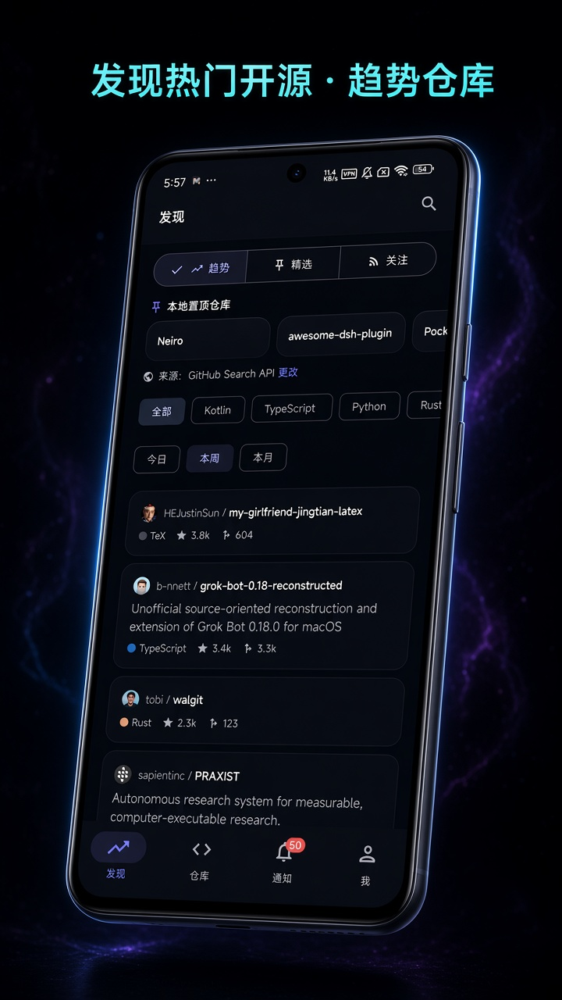
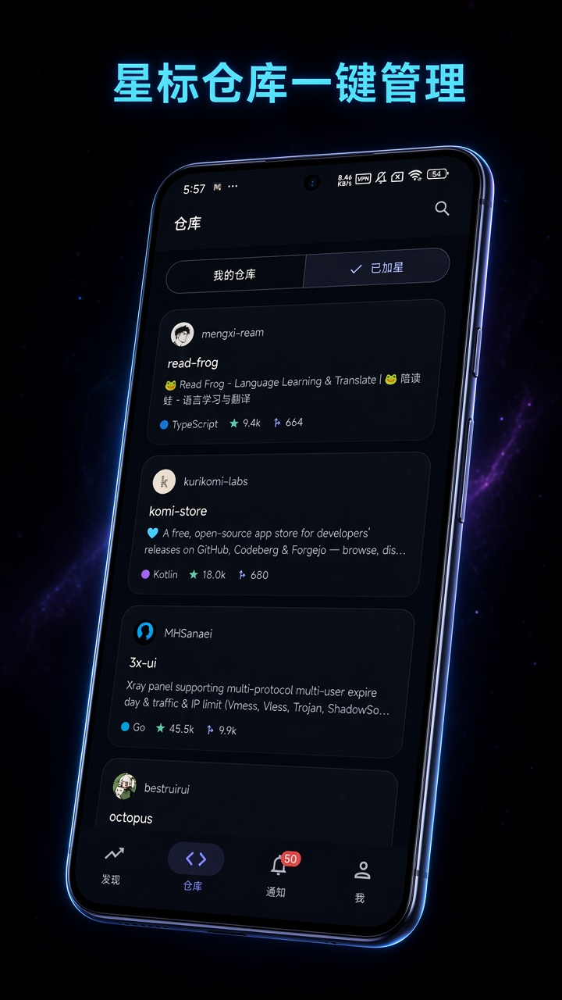
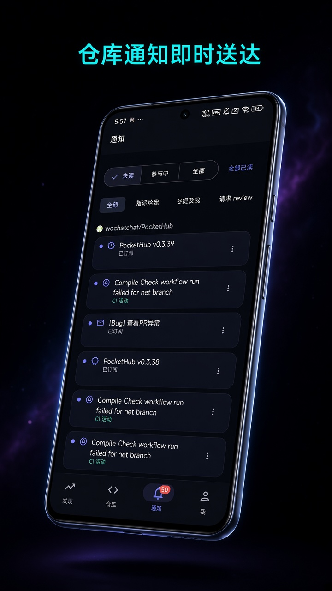
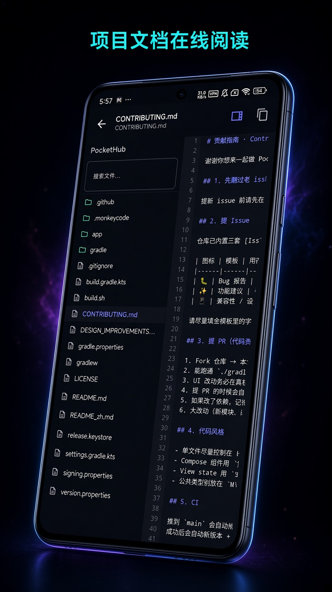
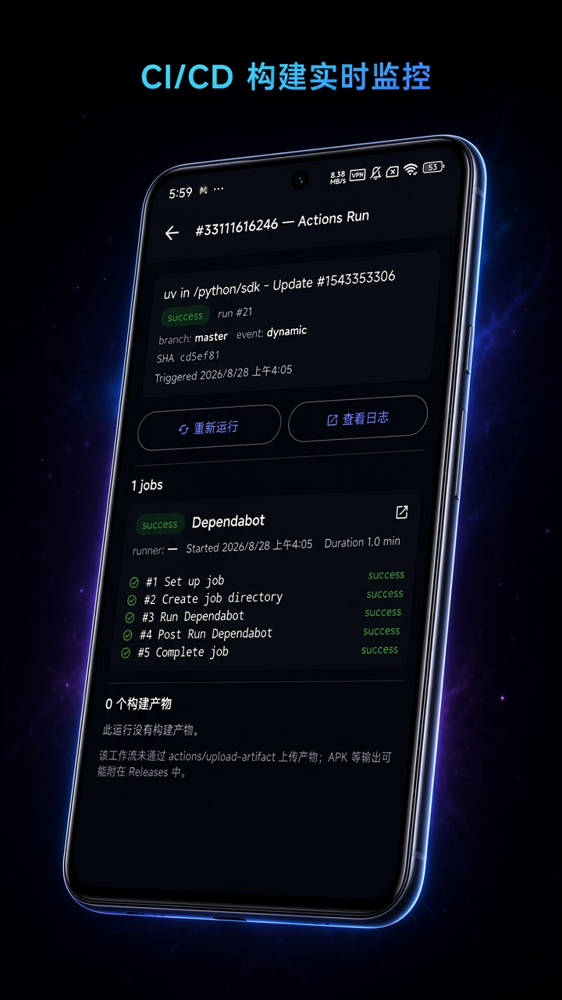
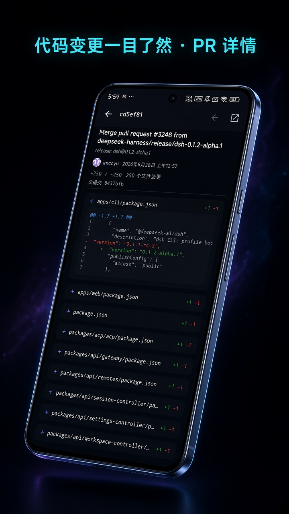

# PocketHub

  

一款精心打磨的开源 Android GitHub 客户端，基于 Kotlin + Jetpack Compose + Material 3 构建。

> 状态：**开发中** (V1 — 核心客户端)。

**[English README](README.md)** · **[GitHub Releases](https://github.com/wochatchat/PocketHub/releases)**

---

## 应用截图

<table>
  <tr>
    <td></td>
    <td></td>
    <td></td>
  </tr>
  <tr>
    <td></td>
    <td></td>
    <td></td>
  </tr>
</table>

---

## 功能特性

### 认证方式
- 个人访问令牌 (PAT)
- OAuth 应用（内置默认客户端 + 支持自定义客户端覆盖）

### 导航（4 个标签页）
1. **探索** — Trending 仓库/开发者、关注动态
2. **仓库** — 你的仓库 + 星标，支持筛选和排序
3. **通知** — 按仓库分组，未读/已读
4. **个人主页** — 多账号、草稿箱、设置

顶部栏提供全局搜索入口。

### 仓库详情
标签页：概览（README）· 代码（文件树）· Issues · PR · 提交记录 · Releases · Actions
（Wiki / Projects 尚未支持，计划 V2 加入）

### 主题
- **暗色（Linear 风格）** — 默认，紧凑、沉稳的配色
- **亮色（GitHub Primer 风格）** — 通透、温暖的卡片感

### 离线缓存
- 主要读取路径均有 Room 本地缓存（仓库、Issues、Releases、Trending、动态流）
- 优先展示缓存，每条数据独立 TTL
- 后台系统通知（WorkManager，去重）提醒新未读通知

### 自动更新
- 启动时和应用内「设置」均会轮询 GitHub Releases
- 发现新版本稳定版会弹窗提示（下载 / 忽略此版本 / 稍后提醒）
- 已忽略的版本不会再提醒，直到推送更新
- Pre-release 不会自动弹出

### 多账号
- 同时登录多个 GitHub 账号
- 快速切换账号

## 技术栈
- Kotlin + Coroutines + Flow
- Jetpack Compose + Material 3
- AndroidX（Lifecycle、ViewModel、Navigation Compose）
- Room（本地持久化）
- Hilt（依赖注入）
- OkHttp + Retrofit（GitHub REST API v3）
- Coil（图片加载）
- DataStore（偏好设置）

## 开源协议
Apache 2.0（见 [LICENSE](LICENSE)）。

## 致谢
- 感谢 [@Wxjxpp](https://github.com/Wxjxpp) 在 [PR #32](https://github.com/wochatchat/PocketHub/pull/32) 中贡献了以下几处重要功能的核心代码与实现思路（已整合进主干）：
  - **加密 DNS（DoH）可配置化**，内置服务商选择（见 [commit 00976c7](https://github.com/wochatchat/PocketHub/commit/00976c7)）
  - **下载加速镜像预设**与真实下载测速（见 [commit f54348e](https://github.com/wochatchat/PocketHub/commit/f54348e)）
  - **自托管 OAuth 交换后端**协议（`/config` + `/oauth/exchange`）及应用侧客户端实现（见 [commit f8fbb47](https://github.com/wochatchat/PocketHub/commit/f8fbb47)）
  - **OAuth state 回调防伪校验**，以及两处登录链路修复：浏览器返回时回调经 `onNewIntent` 送达（[2a878e3](https://github.com/wochatchat/PocketHub/commit/2a878e3)）、登录页与主活动共享同一 ViewModel（[dd8c6cf](https://github.com/wochatchat/PocketHub/commit/dd8c6cf)）

## 贡献指南
- 发现 bug 或有想法？直接 [提 issue](https://github.com/wochatchat/PocketHub/issues/new/choose)，已内置模板帮你把话讲清楚：
  - 🐛 **Bug 报告** — 仓库详情/下载/通知等任何模块炸了或显示乱码，选这个
  - ✨ **功能建议** — 想加的能力或改进，选这个
  - 📱 **兼容性 / 设备问题** — 在你的机型/ROM 上的诡异表现，选这个
- 想直接贡献代码？先 fork → branch → PR，PR 模板里也列了自查清单。
- 详细约定见 [CONTRIBUTING.md](CONTRIBUTING.md)。

---

## ☕ 打赏支持

如果 PocketHub 帮到了你，欢迎请我喝杯咖啡！

  

  <strong>感谢你的支持！💖</strong>

  <a href="README.md">English</a> · <a href="README_zh.md">中文</a>

